  
## Mineral mapping - pretty pictures, perilous pitfalls  
*(and apparently ripe for alliteration!)*  
   
Mineral maps are the perfect product for a geologist. They break the core into domains and show, at a glance, 
the picture of the rock we only build in our heads after years of training. They are immediately interpretable, and they look confident.

They look just as confident when they're wrong.

If you have heard of hyperspectral data, at a surface level, then a mineral map is what you think of.  

There is a wide variety of methods to produce mineral maps, all of them extremely effective *under certain conditions*, many involving 
advanced ML techniques, and many are proprietary.  

[CoreSpecViewer](https://github.com/Russjas/CoreSpecViewer) exposes a small subset of Mineral Mapping tools; Pearson correlation, 
Spectral Angle Mapping and Modified Spectral Angle Mapping (which is functionally Pearson). Pearson correlation measures whether two spectra rise and fall together, ignoring their overall brightness. 
SAM treats each spectrum as a vector and measures the angle between them. Both reduce the comparison to a single 
number over the whole wavelength range.
  
I am only going to talk about one method here; Pearson correlation. I expose a simple winner-takes-all 
implementation of this method in CoreSpecViewer and the criticisms that I level at this method also applies to the SAM method in CoreSpecViewer,
but do not necessarily apply to **all** mineral maps that you may have access to.  
    
::: {.callout-note}
## The example boxes

- **Box 1**: well 13-18-088-11W5, 1590.80–1593.60 m, scanned 2022-02-11.
- **Box 2**: drillhole DH-64-03, Carrowreagh, 0.00–1.00 m, scanned 2026-08-31.

Data sources and licences are listed in the [Data](#data) section.
::: 

### Many mineral maybes  

{fig-align="center" width=80%}  

This is the mineral map I produced in my hyperspectral made easy [note](hyperspectral-made-easy.qmd). The mineral map was produced by Pearson correlation
of every pixel in the image against every exemplar in the library. The CoreSpecViewer Pearson winner-takes-all pipeline is multi-step;  
  
- take a specified collection from the library,  
- resample the library spectra to the data wavelength grid,
    ^[convolution is coming to CoreSpecViewer, but early testing shows that on the core scanning grids, it does not make a huge difference to SAM or Pearson over resampling]
- remove the continuum of the library spectra using the same method as for the data,
- for each pixel, calculate the correlation coefficient of the continuum removed spectra against each library exemplar, 
and assign that pixel the value of the exemplar with the highest coefficient,  
- assign every pixel with a coefficient below a threshold (0.7 by default) a no-result value.

In the image above, you can see the downsides of this full library approach. Montmorillonite and calcite are likely really in the core. 
Elemental sulfur is obviously nonsense, and all of the feldspars (which have no diagnostic features in SWIR) 
are unlikely to be actually recorded in SWIR data.  

So, a winner-takes-all approach is really only as good as the pool of potential winners it is exposed to.  

### Curated collections

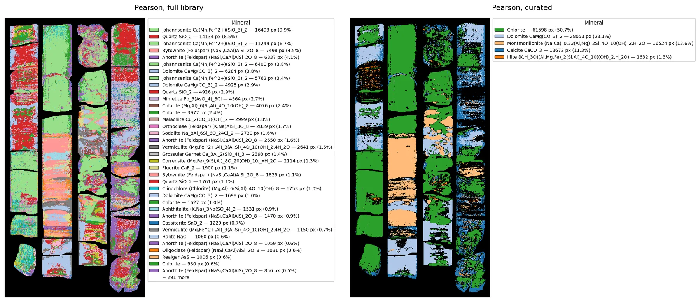{fig-align="center" width=80%}

Against the full library, Box 1 is mapped with a host of minerals that have no business being in SWIR data:
quartz (no SWIR features at all), Johannsenite (just... probably not) and a whole suite of feldspars. Over 300 different
library exemplars won at least one pixel.

Against a curated collection of five common rock-forming minerals, each with diagnostic SWIR features, the map is clean
and geologically plausible. It also has gaps, where no exemplar cleared the threshold.

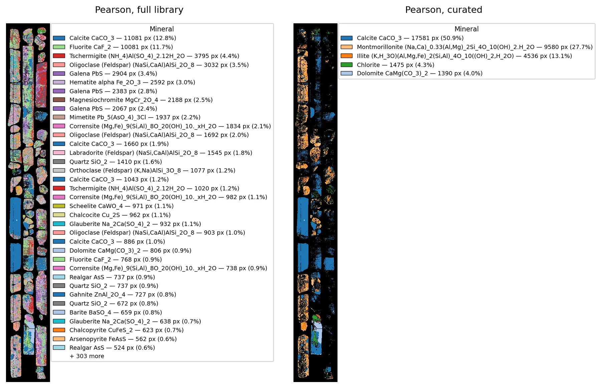{fig-align="center" width=80%}

Box 2 follows the same pattern, but here the gaps are far bigger. Whole pieces of core go unclassified.

Mapping against a full library sets the method up to fail. Pearson and SAM both compare the entire spectrum and reduce
the comparison to a single number. Once a feldspar spectrum is cropped, resampled to the scanner's wavelengths and
continuum-removed, it has nothing diagnostic left, just broad shape and noise. A noisy or featureless pixel can match
that very well. The absorption features you actually care about end up competing with the flat, noisy parts of your
own data.

Curating the collection fixes this, and it has real value. You usually know the geology of your core already; what you
want from the map is where those minerals are. A curated map shows that clearly.

But curating moves mineral mapping away from being data-driven and towards being knowledge-driven. You will only ever
get confirmation of the minerals you expected.

There won't be any surprises, only gaps.

### Spectral span  
  
So, performance can be improved by only presenting the algorithm with a limited selection of exemplars to choose from. It can also potentially 
be improved by only presenting the algorithm with a limited spectral range to match.  
  
{fig-align="center" width=80%}
  
Here the spectral range that was used was 2000nm - 2600nm, and by using this range we have selected a spectral region where actual features are more likely to
impact the correlation, more than flat noisy regions.  
  
The performance is definitely improved for full library-restricted spectra compared to the full library-full spectra above.
There are far fewer matches against spectrally inactive minerals, but there are still a lot of unlikely minerals scoring highly.  

The performance of the curated set in restricted range is also very interesting. The legends show the pixel counts, and 
more pixels are classified overall on the restricted 
range image, but the gaps are more coherent - the confident Montmorillonite domain from the full-range curated set is largely gone.
Montmorillonite and illite share an Al-OH feature near 2200 nm; the main
thing separating them in the SWIR is the water feature near 1900 nm, which is much deeper in montmorillonite. Cut the
range at 2000 nm and the strongest evidence for montmorillonite goes with it. So the full-range montmorillonite call
was driven by water. That might be real smectite, or it might just be water.  

{fig-align="center" width=80%}
    
Again, we see the same improvement in the use of the full library, but here the unlikely minerals are taking a greater proportion of the pixels.
Sodalite and strontianite between them account for over a third of the classified core, and are unlikely. 

The curated set shows the same montmorillonite-to-illite swap, and it is even starker, montmorillonite is barely present. 
But here the restricted range also classifies far more of the core. The gaps in the full-range map were not "nothing there". 
The Al-OH and carbonate features near 2200 and 2340 nm were present all along, but outside that window the spectra didn't look enough like any exemplar, 
and the whole-spectrum correlation fell below the threshold. By restricting the range to where the features are, the features have a much greater 
impact on the match.

This approach also raises a potential issue with the default threshold; a correlation of 0.7 over a restricted 600 nm range 
is not the same test as 0.7 over the full range, so the threshold changes meaning when the range does. 

This has demonstrated that mineral mapping is not a final product, but something to be interpreted.  
To really get the most out of them, you have to put your thumb on the scale. You need to apply domain knowledge of:  
  
- The likely mineralogy of what you are looking at;
- The spectral features you expect from that mineralogy, and where they are;
- What the applicable threshold should be.  
  
When I first started looking into spectral geology, I thought mineral maps were a data-driven product. They look and smell data-driven.  
  
However, to get a mineral map that is useful, it ends up looking like a knowledge-driven product after all.  
  
*With all the caveats from above that this may not apply to every mineral map product that you might have seen*  
  
## Expert systems
*(These don't alliterate as cleanly.)*

I am going to look at two expert systems, of many. Both are published, and both are purely knowledge-driven: no
library matching and no correlation, just actual measurements from the spectra and tested by thresholds that someone who knows the
minerals has chosen.

Before the figures, a caveat that applies to both. These are not fair tests. A decision tree is built for a
particular geology, and its thresholds encode what the author expected to find there. Below, I run each tree on core
it was not built for, as-is, with no tuning. That is the point I want to make, but it means the maps show what
happens when a tree is moved, not how well it works at home. Additionally, the HypPy algorithm was ran using HypPy, but on a decision tree that I coded
from descriptions in the paper - mistakes in implementation and performance are entirely my own and do not reflect on the authors' work.

### HypPy system
Taken from [van Ruitenbeek, F.J.A., Bakker, W.H., van der Werff, H.M.A., Hecker, C.A., Hein, K.A.A. and van Eijndthoven, W. (2025):
A Knowledge-Based Strategy for Interpretation of SWIR Hyperspectral Images of Rocks; *Remote Sensing*, 17(15), 2555.](https://www.mdpi.com/2072-4292/17/15/2555)

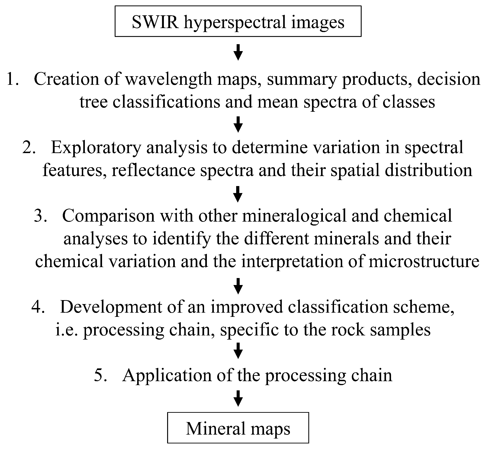{fig-align="center" width=80%}

This paper is a response to several of the problems I raised above, among others (read it, it is very good).
Their answer is to classify on the wavelength positions of absorption
features, which are set by the physics of the mineral and do not change between scenes. Each pixel gets the
position and depth of its three deepest features, and decision trees with fixed thresholds turn those into classes.  
  
Note that the decision tree is step 1 of 5. The strategy is to explore the results, compare them with petrography
and chemistry, then build a tree specific to the rocks in hand, and only then run it as a processing chain.
  
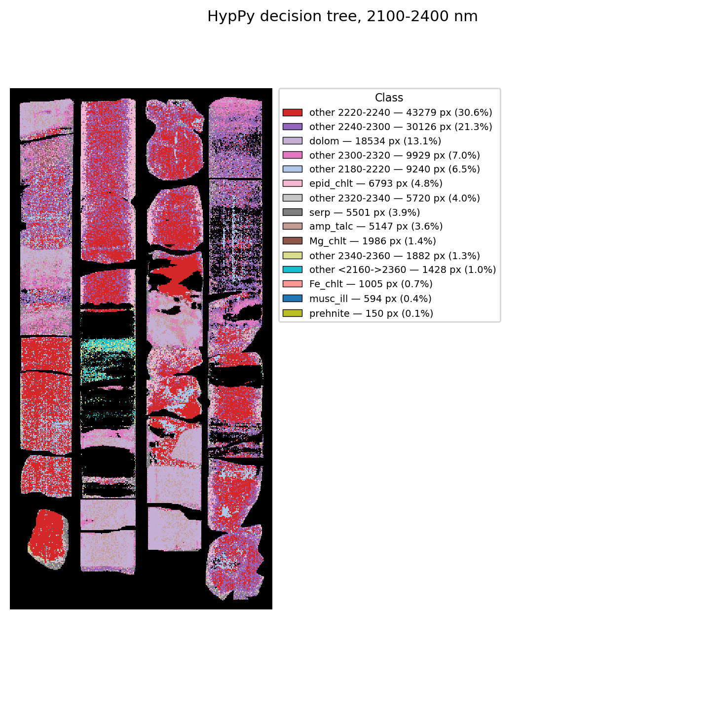{fig-align="center" width=80%}  

About 70% of this box lands in one of the "other" classes. Those are pixels with a perfectly real deepest feature,
in a position the tree has no mineral for. The largest class, at 30%, is a deepest feature between 2220 and 2240 nm.
Montmorillonite has nowhere to go either: an Al-OH feature near 2205 nm with no partner near 2350 nm falls through
the white mica test into "other 2180–2220". Meanwhile serpentine, amphibole/talc, epidote/chlorite and prehnite all
appear, because this tree was written for hydrothermally altered volcanics from the Pilbara.

None of this is a failure of the method. It is the method telling you that it does not know this rock, which is
arguably better than a confident wrong answer. But it does show that a decision tree is only as portable as its
author's experience.


### Carbonate spectral facies
Taken from [Rogers, R. and Pracht, M. (2023):
Hyperspectral Facies Analysis as a Lithological Interpretation Tool for Carbonate Rocks; *Geosciences*, 13(12), 381.](https://www.mdpi.com/2076-3263/13/12/381)

*Yes, this is my paper, but I already had the code.*

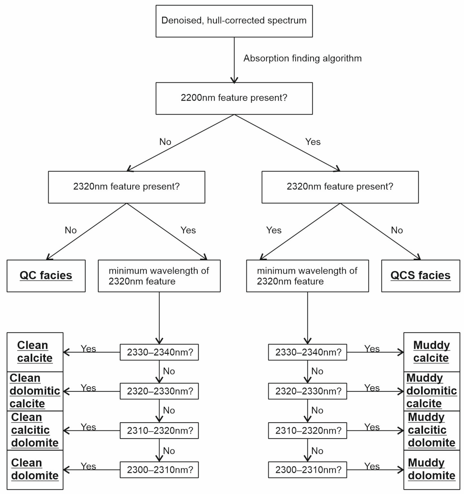{fig-align="center" width=80%}

This tree is much simpler. It asks two questions: is there a feature near 2200 nm (argillaceous material, "muddy"
or "clean"), and where is the carbonate feature near 2320 nm (calcite to dolomite, in 10 nm bins)? Ten facies,
built for the Irish Carboniferous. The code lives in CoreSpecViewer as an archive, and can be seen
[here](https://github.com/Russjas/CoreSpecViewer/blob/main/app/spectral_ops/_legacy.py).

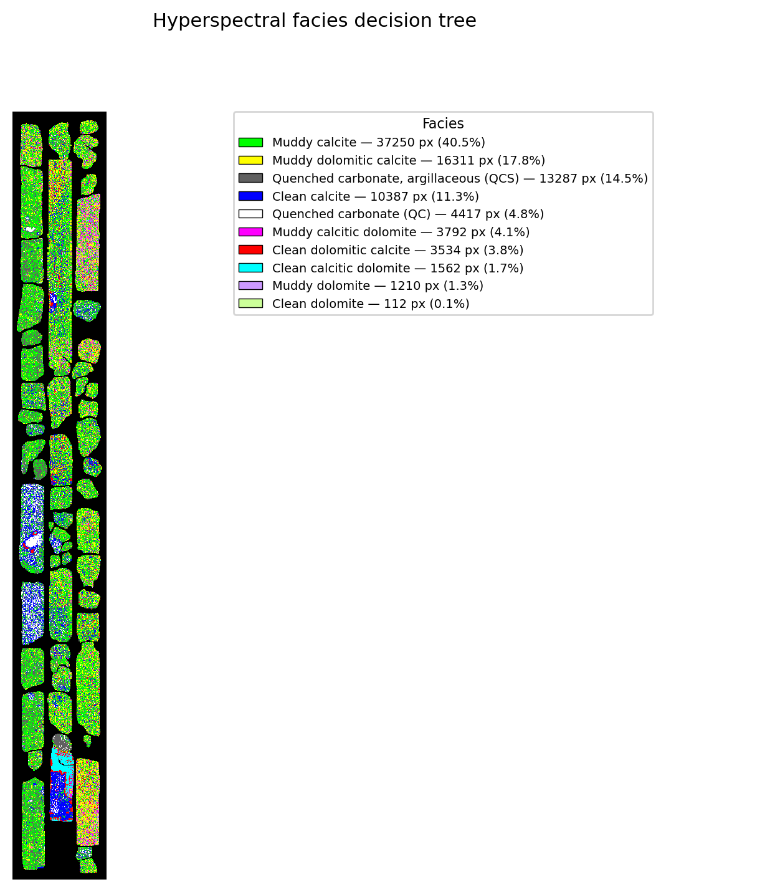{fig-align="center" width=80%}

This is closer to home, Irish Carboniferous carbonate, and the result is far more plausible: muddy and clean
calcite dominate, with dolomitic patches and a quenched domain. But it is speckled, and it is not entirely fair to
the paper either:

- The paper's facies were read as downhole logs and box-scale patterns, where pixel-scale noise averages out. A
  single box at pixel resolution shows the noise the logs smoothed over.
- The "is there a 2200 nm feature?" test in this archived code accepts *any* local minimum in the window, with no
  depth threshold. A little noise in a clean limestone is enough to call it muddy, which will be inflating the
  muddy facies here. (I wrote that, and I'd add a depth threshold today.)
- Every pixel with a carbonate feature is forced into one of eight bins. The tree cannot say "not carbonate" except
  through the quenched classes, so anything else is reported as a carbonate facies.

The pattern is the same as with the curated libraries: the knowledge goes in up front, and you get back what the
tree's author expected. Inside the workflow that they were specifically designed for, they can produce very useful products. Outside of that specific 
workflow, they need customising, and in HypPy's case that customising is built into the method.


## Tetracorder, splitting the difference  
(*You got your library in my decision tree!*)  
  
So, we have looked at two approaches. Correlation methods compare whole spectra against a library and give you a number but no
reason. Decision trees measure features and give you reasons, but only the ones their authors included.

Tetracorder, built by Roger Clark and colleagues at the USGS over decades, is both.
It is a decision tree whose leaves are library comparisons.  

[Roger N. Clark, Gregg A. Swayze, K. Eric Livo, Raymond F. Kokaly, Steve J. Sutley, J. Brad Dalton, Robert R. McDougal
and Carol A. Gent, 2003, *Imaging spectroscopy: Earth and planetary remote sensing with the USGS Tetracorder and expert
systems*, Journal of Geophysical Research, Vol 108.](https://github.com/PSI-edu/spectroscopy-tetracorder/blob/main/documentation/clark.et.al.2003.tetracorder.JGR.2002JE001847.pdf)  
  
[Authoritative repo](https://github.com/PSI-edu/spectroscopy-tetracorder)  
  
### Tetracorder overview  

This is a very high level overview; read the paper for all the details (it is very good).

Tetracorder runs on Linux, is written in Rational Fortran (Ratfor) on top of the USGS specpr package, and is driven by cmd
files. [Tetracorder-lite](https://github.com/emit-sds/tetracorder-lite) builds the original in a Docker container and has a
Python interface to drive the cmd files and the original.

I have reconstructed the original cmd files that contained the expert system into a structured json dataset, and have
reimplemented the numerical calculation modules from the original system into Python. I felt the need to do this because
the expert system is the valuable part, and in its native form it is very hard to get at. The rules are spread across cmd
files, with thresholds substituted in from preset files at run time, so you can't easily see what a rule actually tests
for, let alone change it. Running the original means running a Linux build of a 30-year-old Fortran system, one pixel at a
time, configured for airborne and orbital sensors. I wanted to point it at core scanner data, switch off the parts that make
no sense for core, see why a rule won or lost, and plug it into CoreSpecViewer. That meant reimplementing it, and that only
counts if the port gives the same answers as the original, which it *mostly* does ([fidelity work](https://github.com/Russjas/python-tetracorder#fidelity)).

I am going to define some terminology to discuss Tetracorder, although a lot of this terminology is my own mental shorthand.  
  
|Term|Description|
|---|---|
|Rule|Contains a library reference spectrum, the features to be tested and constraints it must conform to.|
|Feature|Can be a positive or NOT feature.|
|Positive feature|A wavelength interval bounded by two continuum windows, and tests it must pass.|
|NOT feature|Points to a feature of another rule. If that feature is present above a set depth and fit, this rule is rejected.|
|Role|Each positive feature has a role; diagnostic, must-have, weak or optional. Diagnostic and must-have features count towards the fit and must be present; weak features must be present but don't count towards the fit; optional features count if present and are ignored if absent.|
|Constraint|Thresholds on the rule's combined fit, depth or fit × depth, applied on the full rule result after all features have been evaluated.|
|Fit|An output of the fully evaluated rule. Fit describes how well the target spectrum matches the reference across all of the rule's features: each feature's match is weighted by that feature's size and the results are combined.|
|Depth|An output of the fully evaluated rule. Depth describes how strongly the reference's absorptions show up in the target: each feature's band depth is weighted by that feature's size and the results are combined.|
|FD|An output of the fully evaluated rule. Fit × Depth, calculated for each feature and combined the same way.|
|Group|A collection of rules that compete to obtain the classified material. Only the best fit in a group survives, and competition is generally only within a group|
|Group 0|Rules that compete in every group, with some exceptions|
|Case|Certain rules trigger a Case if they win their Group. A Case is a second, smaller competition that only runs when it is triggered, and it refines the winner|  
  
#### A rule  

```json
{
  "calcite.33+kaol.33+mus-AMXr2": {
    "kind": "group",
    "number": 2,
    "use": true,
    "udata": "reflectance",
    "convolve": false,
    "preratio": null,
    "preprocess": null,
    "algorithm": "tricorder-primary",
    "id": "calcite.33+kaol.33+mus-AMXr2",
    "library_records": {
      "SMALL": {"library": "[sprlb06]", "record": "1038"}
    },
    "reference_title": "Calcite.33+Kaol.33+Mus AMXr2 W1R1Ba",
    "output_title": "Calcite.33+Kaol.33+Mus AMXr2",
    "materials": [
      {"name": "calcite"},
      {"name": "kaolinite"},
      {"name": "muscovite"}
    ],
    "identification_confidence": 8,
    "constraints": [
      {"test": "FD-FIT>", "values": "[GLBLFDFIT]"},
      {"test": "DEPTH-FIT>", "values": "[GLBLDPFITg2]"},
      {"test": "FITALL>", "values": "[GLBLFITALL]"}
    ],
    "features": ["... truncated ..."]
  }
}
```

#### A positive feature

```json
{
  "id": "f1a",
  "number": 1,
  "reference_alias": "a",
  "role": "diagnostic",
  "source_code": "DLw",
  "continuum": "linear",
  "coordinates": "wavelength",
  "windows": [
    [2.135, 2.163],
    [2.235, 2.265]
  ],
  "tests": [
    {"test": "ct", "values": ["[CTHRESH4]"]},
    {"test": "r*bd>", "values": ["[RBD22]"]}
  ]
}
```

#### A NOT feature  

```json
{
  "id": "n1a",
  "number": 1,
  "reference_alias": "a",
  "role": "not",
  "source_reference": "[NOTMUSCOVITE1]",
  "source_feature": "f2a",
  "depth_condition": {
    "mode": "relative",
    "threshold": 0.22,
    "relative_to_feature": "f1a"
  },
  "fit_threshold": 0.6,
  "source_material": "muscovite-medhigh-Al"
}
```  
  
I won't go into the details of the above, but you can see that a rule has a pointer to its library reference spectrum,
the materials it represents, a confidence level, its constraints and its list of features. A positive feature has its
role, the type of continuum, its two continuum windows and the tests it must pass. A NOT feature has the rule and
feature it points to, and the depth and fit that feature must exceed to veto this rule. Values in square brackets, like
`[GLBLFDFIT]`, are placeholders filled in from a preset at run time, which is how one rule set is tuned for different
sensors.

All of the information required to evaluate each feature, fully evaluate the rule and ultimately classify the pixel is
encoded into each rule as a recipe. The evaluation code just follows the recipe, runs the competition, and classifies
the pixel with the winning rule id in each group.

#### The competition and classification

The decision tree element is actually a competition between the final fit value of each fully evaluated rule, within a group.  
The fit value that each of the 707 rules has after evaluation is an expression of tremendous domain expertise:

- which features are diagnostic, and how much each one counts;
- minimum fit and depth thresholds;
- *NOT* features: absorptions that must be absent, so a mineral is rejected if, e.g. a carbonate feature is present
  where it shouldn't be;
- which spectral region it competes in. Materials compete in groups (1 µm, 2 µm and so on), and each group picks
  its own best match, so one pixel can have an iron oxide answer and a clay answer.

In other words, it is a curated collection *and* a restricted spectral range *and* a decision tree, with the
curation done in advance by people who knew far more spectroscopy than I do. This system is mature, has been validated by years of ground truth work
and is the standard tool for major data releases (e.g. the EMIT L2B products).  

It was, however, built for airborne and planetary data, not core.

## Tetra-CORE-der  
  
::: {layout-ncol=2}
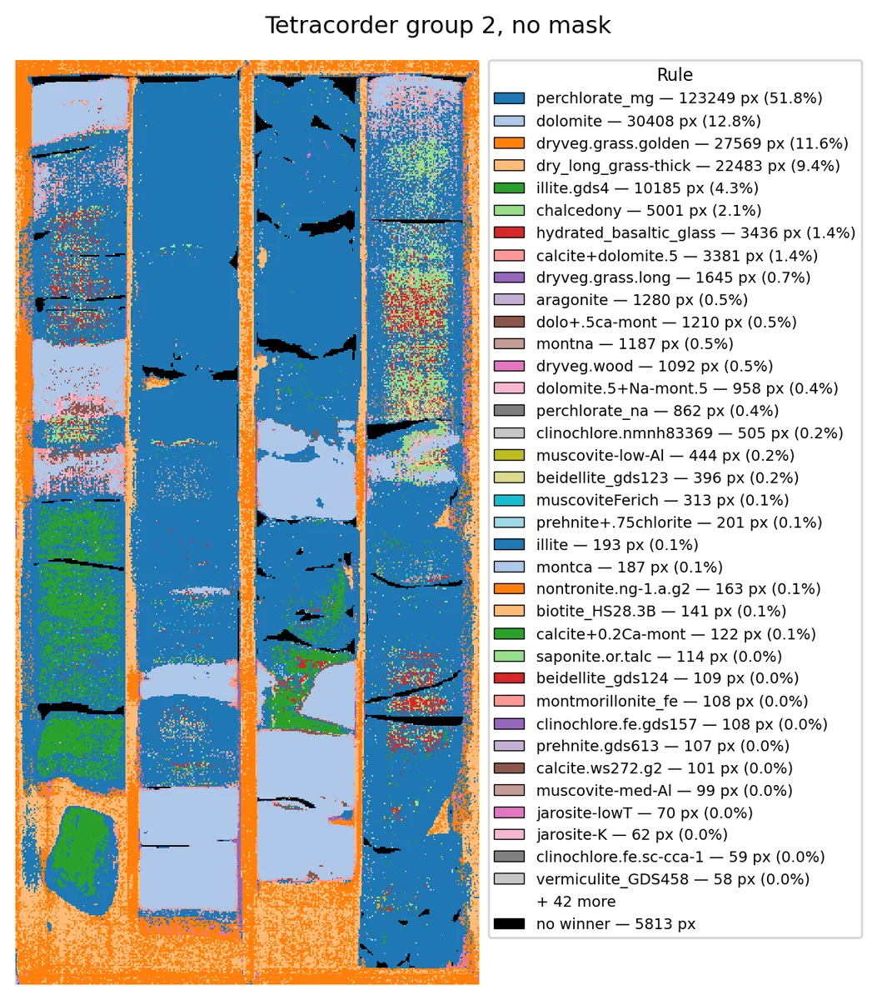

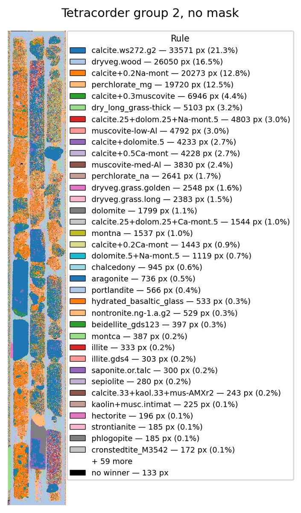
:::

These two maps are the result of feeding our two boxes directly to Tetracorder, using only the default presets and no masks or custom disabled material list.  
Interestingly, amusingly, and perhaps unsurprisingly the algorithm identified the wooden core box of Box 2 as dryveg.wood and the cardboard box of Box 1 as a 
mixture of dryveg.grass.golden and dry_long_grass-thick. This entertainingly (to me, anyway) demonstrates that there are some remote sensing assumptions 
built into the machinery that we need to accommodate for core scanning uses.  
Refinement one; we are not interested in the box or background composition and we almost certainly have a core mask, let's use it.  
  
::: {layout-ncol=2}
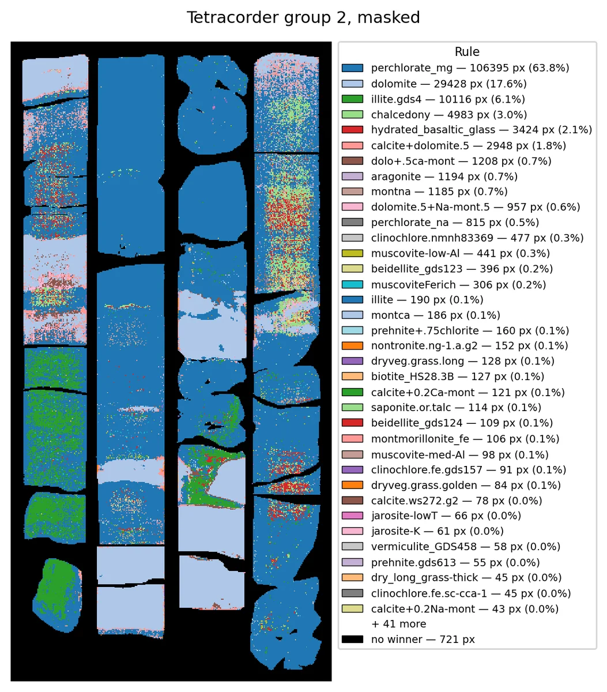

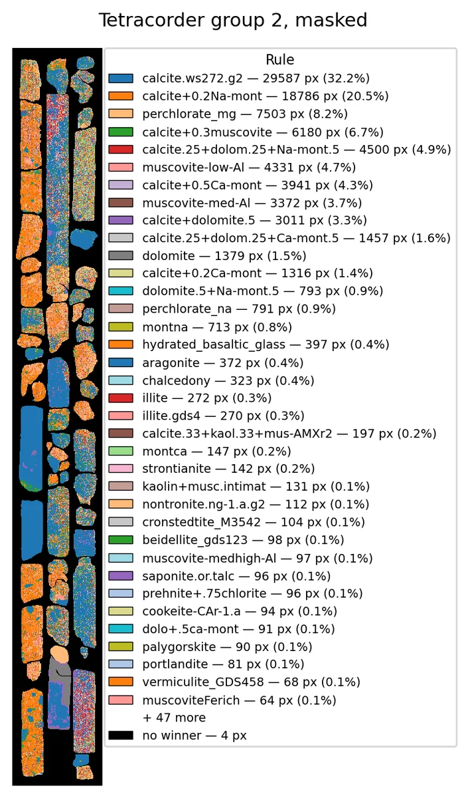
:::  
  
These are much nicer. Box 1 is showing dolomite as we should expect by now, and Box 2 has large coherent domains of calcite. But perchlorate_mg? In great
quantities in both boxes? Probably not.  
  
The perchlorate_mg rule is for the hydrated salt, magnesium perchlorate, and I would guess that it was included in the original rule set 
because it was found on Mars. Not relevant to core scanning - for the moment.  

There are a number of other rules like this, that exist for a circumstance I am not using. Tetracorder itself actually recognises this, and has machinery
to declare certain rules as not to be used.  
Tetracorder disables materials in three ways;  

- User declared disabled,
- Disabled by temperature and pressure constraints, which are used to stop ice and water rules competing in desert scenes,
- Disabled by the limitations of the instrument's band range.

My Python port also carries this machinery and I have assembled a core scanning disabled materials list with entries 
like perchlorate_mg, snow, ice, water, and all the vegetation categories.  
  
::: {layout-ncol=2}
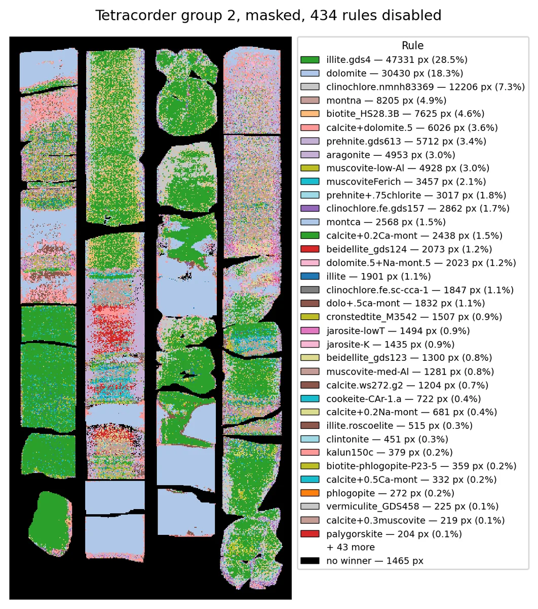

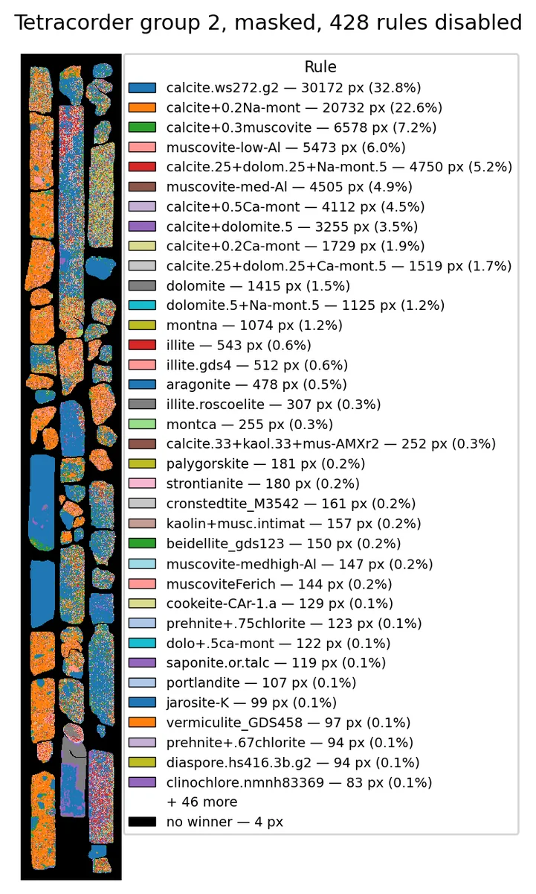
:::  
  
Okay, this is starting to look plausible and useful. The vast majority of pixels are classified, and most of those are classified by realistic possibilities. 
There are a few outlandish classification remaining, but not on the same scale as the options presented by the full library comparisons in the 
winner-takes-all maps above. 

At this level, Tetracorder has a second layer of expertise encoded, in its post-processing. The raw output is one image
per rule, and a map with 80 rule ids on it isn't something anyone wants to log from. So the native system ships with
theme scripts (27 of them, written for davinci) that gather rules into colour themes: a 2 µm minerals map, a 1 µm
minerals map, water, pyroxenes and so on. It also ships with a classification that groups each rule's materials into
mineral families. This is the step where `calcite.ws272.g2` and `calcite+dolomite.5` stop being separate answers and
become calcite, and calcite + dolomite.

I have emulated this, essentially producing a core scanning theme: a lookup that assigns every rule a core logging
category, the names a geologist would actually write on a log. Rules that have no business in a core shed (vegetation,
ices, exotic salts) are tagged as non-geo, which is also where most of the disabled list above came from.

::: {layout-ncol=2}
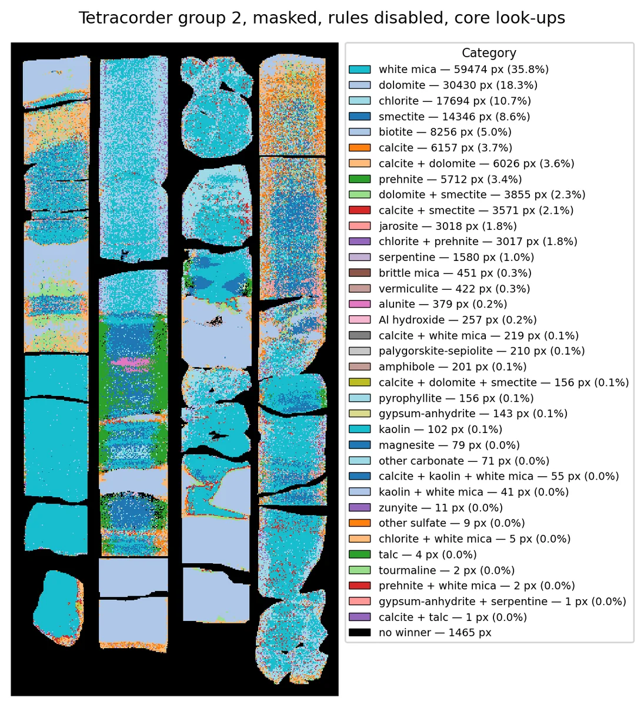

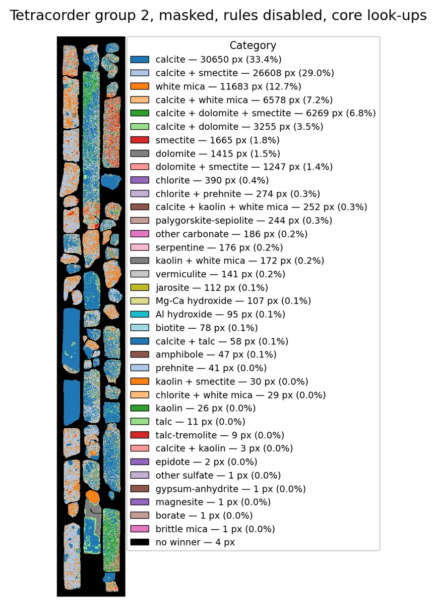
::: 
  
These read like a core log. But be aware of what the lookup is doing: when `calcite+0.2Na-mont` wins on fit, the map
now says "calcite + smectite". It is not just merging names. It turns "this mixture reference fitted best" into "these
minerals are present", which is a stronger claim than the fit alone supports.  
  
However, this has been the case with every flavour of mineral map that we have looked at.

## Conclusions  
  
Pretty pictures, perilous pitfalls.

Every mineral map in this note looked confident but not all of them deserved to.

We have seen three approaches to mineral mapping.

Whole-spectrum library matching appears data-driven, but without curating the choices or restricting the range it will confidently present 
geologically implausible results. Introducing expertise into the interpretation is not a problem in itself, but those curation decisions and the thinking behind 
them are not inherently recorded in the image.

Decision trees have the opposite approach, in these the knowledge and final decisions are all presented clearly up front, they are the whole system. 
But they are only as comprehensive as the knowledge encoded by their authors. Apply them to unfamiliar geology, and they may miss real minerals, 
return large unclassified areas, or confidently assign the wrong classes.

Tetracorder combines the strengths of both. The knowledge encoded in it is granular and fantastically detailed, it is run feature by feature, 
on features an expert chose, with an expert's rules about what must be present, what must be absent and what competes with what. The curation, the
spectral range and the decision tree are all in one place, written down, and in Python they can be read and changed.
When it calls perchlorate in a carbonate, you can open the rule and see exactly why.  

But Tetracorder is not immune to the same problems. Its rule set was developed for particular applications, instruments and environments. 
Moving it to core scanning requires choices about masking, excluded materials, instrument constraints and how its outputs should be grouped into 
geological categories. The post-processing decisions and grouping are not just cosmetic, they are a fundamental part of the interpretation.

There is also an important distinction between identifying a spectral match and identifying a mineral. A spectrum matching a reference mixture 
does not independently establish the presence of every mineral in that mixture. Converting rule identifiers into convenient geological names can 
obscure that distinction, just as a colourful winner-takes-all map can obscure a poor correlation.

The product of a mineral mapping effort is not the final product. It is simply something else to be interpreted while trying to solve whatever problem 
required you to understand your geology. And if you think about a mineral map in that sense, then it is vital that all the decisions, methods, 
and assumptions that created it are explicit and available.
  
That is the real case for Tetracorder, and the reason I ported it. The knowledge, decisions and assumptions are up front and explicit (and accessible to 
a wider audience now it is in json and the Python ecosystem). But it still fundamentally compares pixel spectra against library spectra.

It is not a finished core product. It was built for airborne and planetary scenes, and it shows: it mapped the boxes as
wood and grass, and found Martian salts in Irish limestone. Almost every pixel gets an answer, whether or not the
answer is strong. And the look-ups that make the result readable also turn "this mixture fitted best" into "these
minerals are present".

So the conclusion is the one van Ruitenbeek *et al.* build into their method: the mineral map is where interpretation starts. 
Check it against the core, the petrography and the chemistry, then tune it for the rocks in hand.
The difference with Tetracorder is that much of the expertise is already there to start from.
  
## Data

### Box 1
Box 1 (hole 13-18-088-11W5) data are published by the
Alberta Geological Survey (AGS) and were downloaded from:

Alberta Geological Survey (2023): Core Data Interactive Map; Alberta Energy Regulator /
Alberta Geological Survey, AER/AGS Interactive App or Map 014,
<https://ags.aer.ca/publications/all-publications/iam-014> [accessed October 2026].

The scanning programme is indexed in Spectrum Geosciences Ltd. and TerraCore Geospectral
Imaging (2026): Index to hyperspectral core scanning imagery for mineral core from the
Athabasca Basin, Canadian Shield, and Western Canada Sedimentary Basin in Alberta;
Alberta Energy Regulator / Alberta Geological Survey, AER/AGS Special Report 129, 15 p.

Contains information licensed under the
[Open Government Licence – Alberta](https://open.alberta.ca/licence).

### Box 2

Box 2 (hole dh-64-03-Carrowreagh) data are available from Geological Survey Ireland,  
 contact gsi.corestore@gsi.ie.  
Contains Irish Public Sector Data (Geological Survey Ireland) licensed under a Creative Commons Attribution 4.0 International (CC BY 4.0) licence.