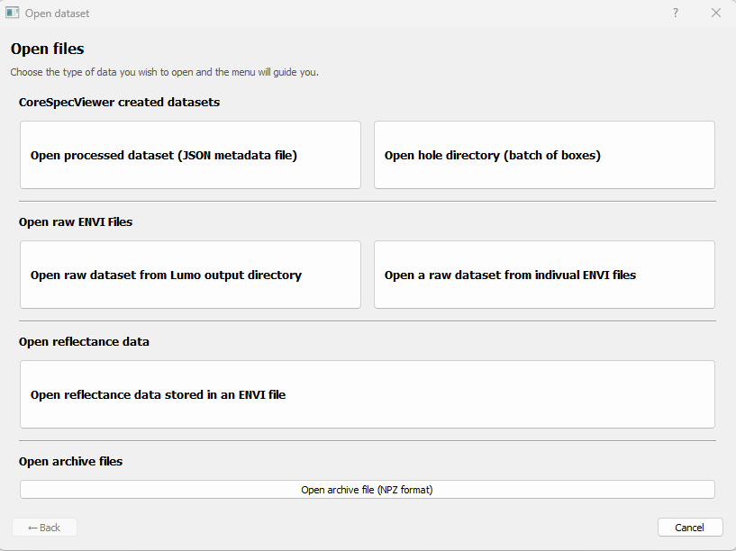
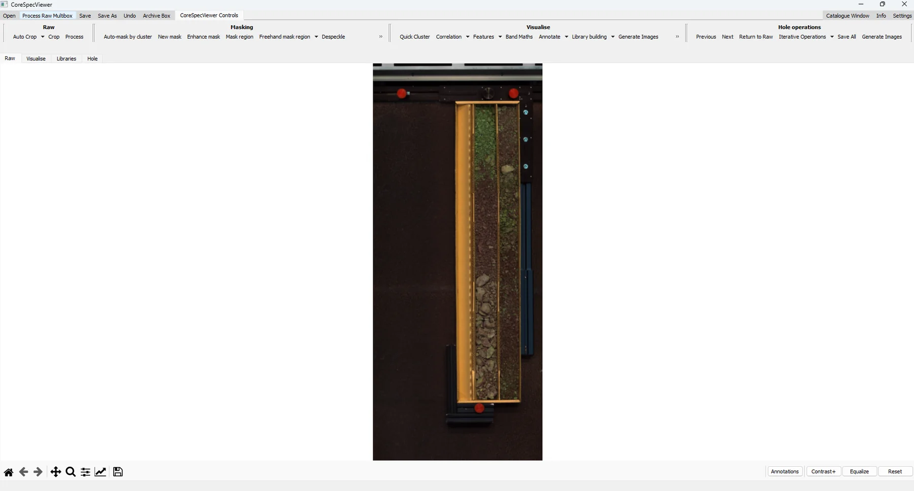
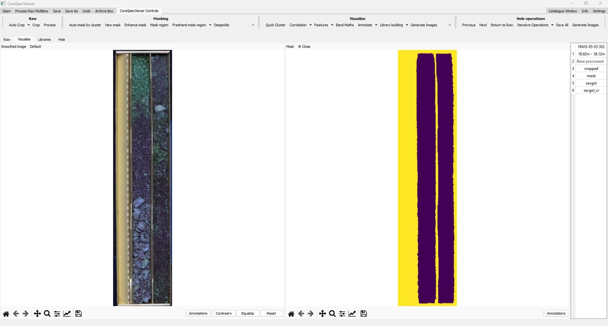
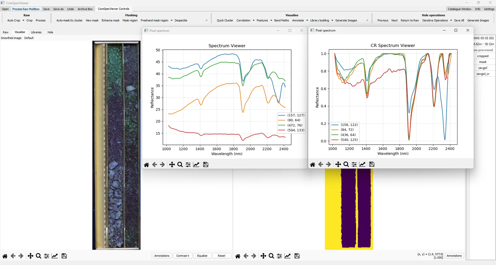
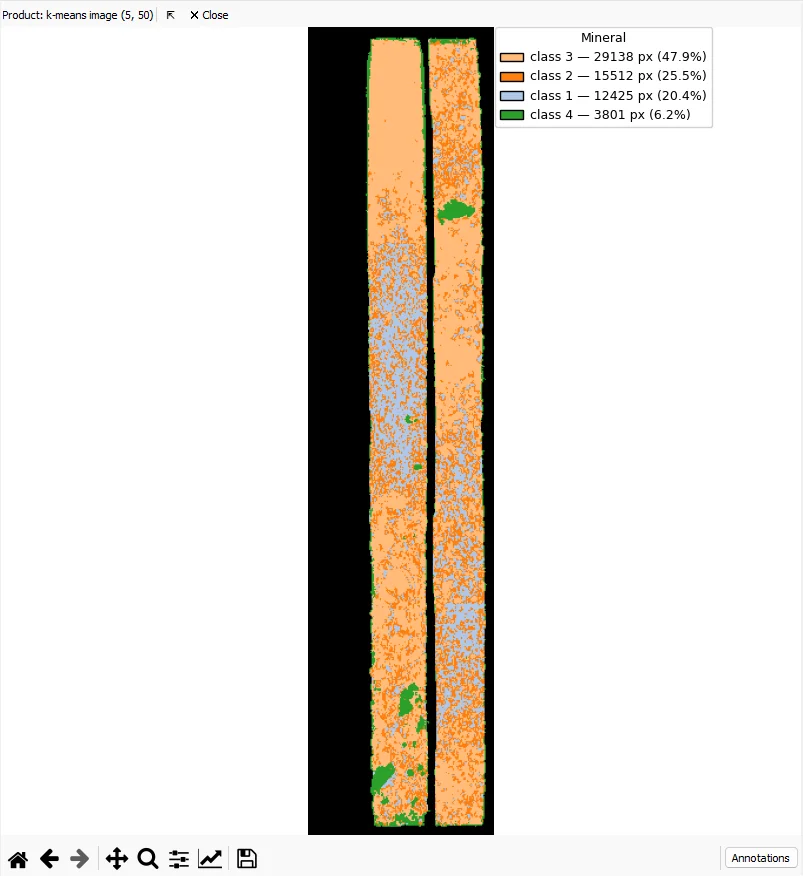
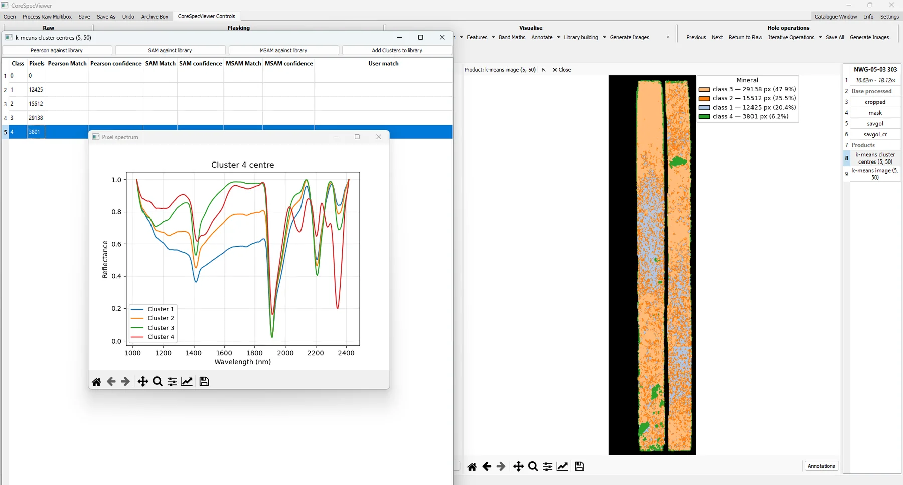
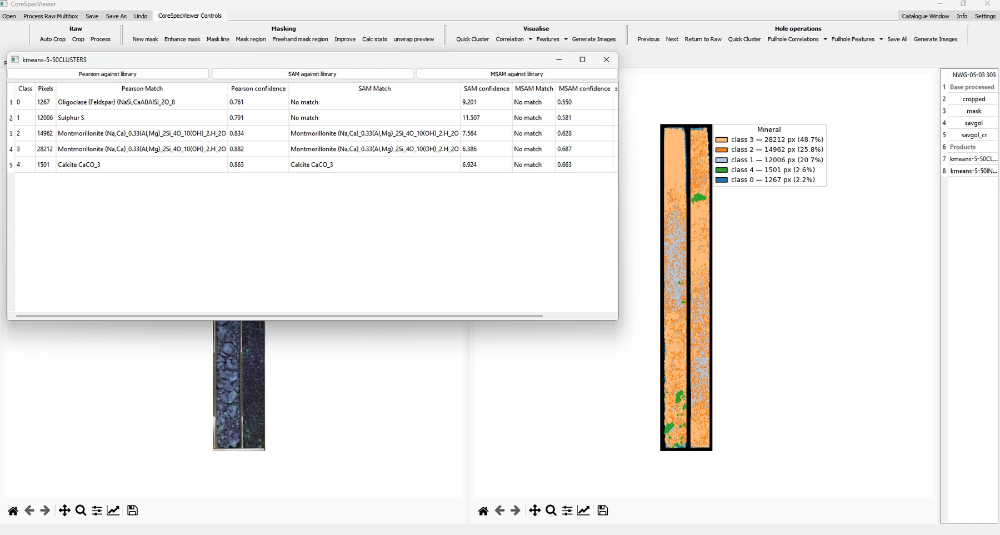
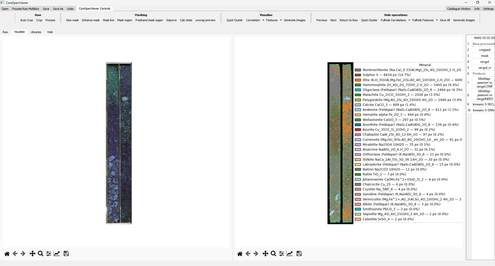

Hyperspectral core scanning can be daunting for the average geologist. 
The file types won't be something you have used before, you may not even recognise them. 
You will be looking for jpegs or tiffs, but the chances are you will get a directory of many files with `.dat`, `.bil`, or `.raw` extensions.

[CoreSpecViewer](https://github.com/Russjas/CoreSpecViewer) simplifies this. It ingests multi-file directories directly:
 Specim Lumo exports, which it was built for, 
and other acquisition formats with a little more manual input.

All of the examples in this article are from core scanned by the Alberta Energy Regulator (AER) [here](https://experience.arcgis.com/experience/1167cc6050f142bdb14a3a6c58e0f584/#data_s=id%3AdataSource_1-186dd8a4977-layer-6%3A724).

I have randomly chosen Hole NWG-05-03, box 303.  

[*This*](https://aerccgrsprdmindat02.blob.core.windows.net/core-scanning/HSI/NWG-05-03/NWG-05-03_SWIR.zip) *is the hole. It is 13GB of SWIR data, be warned.*

### Opening raw data  

CoreSpecViewer exposes a number of data open options through it's load dialogue.  

{fig-align="center" width=80%}
  
Six different load modes  

- Open processed dataset
- Open hole directory  
  
These two refer to CoreSpecViewer's own created data files, these files are what get saved after you have worked with a scan in the software.  

- Open raw dataset from Lumo output directory
- Open raw dataset from individual ENVI files  

These are for raw data from core scans. CoreSpecViewer will expect *at least* six files.

|File|Extension|Description|
|---|---|---|
|`<hole_id_box_number>`|.hdr|Header file for the core scan|
|`<hole_id_box_number>`|.raw, .bil, .bsq, .bip, etc|Binary file for the core scan data|
|WHITE_`<hole_id_box_number>`|.hdr|Header file for the white reference|
|WHITE_`<hole_id_box_number>`|.raw, .bil, .bsq, .bip, etc|Binary file for the white reference|
|DARK_`<hole_id_box_number>`|.hdr|Header file for the dark reference|
|DARK_`<hole_id_box_number>`|.raw, .bil, .bsq, .bip, etc|Binary file for the dark reference|
|`<hole_id_box_number>`|.xml|metadata file - optional|
  
As I built CoreSpecViewer to work with data from the Specim Lumo acquisition software, clicking "from Lumo output directory" just requires the whole 
output directory, and all of the file discovery is automated and the metadata is parsed nicely.  

If your data was acquired any other way, or your directory structure got mangled, the "from ENVI files" allows you to browse to each required file.
The XML will be brute force parsed, but maybe not effectively, and CoreSpecViewer will prompt for the required metadata (hole id, box number, from depth, to depth).  

- Open reflectance data  

This button allows you to open a core scan that has already been converted to reflectance and stored in an ENVI file. 
It will also support existing masks (depending on the format).  

- Open archive file  

This is another file type produced by CoreSpecViewer, the need for which is discussed in this [note](/notes/hyperspectra-data-big.qmd)

### Pre-processing raw data

With hyperspectral data, you cannot just open the file and start interpreting the data, that would be far too easy. The cameras themselves will *usually*
handle some geometric corrections, any spectral binning and some other correction before you get any data.  
That just leaves correcting the radiance data to reflectance, which is why 6 files are needed.  

$$
Reflectance = \frac{Data-DarkReference}{WhiteReference-DarkReference}
$$

BUT! CoreSpecViewer handles all of this for you! If you want to see the implementation it is 
[here](https://github.com/Russjas/CoreSpecViewer/blob/baa9a60ee1a77c17661bb5322a23ef603d4a61b3/app/spectral_ops/IO.py#L295)

Simply find your directory, or selection of files, click load and voilà

{fig-align="center" width=80%}

As this is python application, all of the details of the reflectance correction performed are in the source and 
parts of the configuration is adjustable in the UI. All of the configuration is adjustable in the source code.

This raw data can be cropped in the UI, a mask can be created using a variety of methods, 
and the pre-processing pipeline completed with a few button clicks:
  
{fig-align="center" width=80%}

This image is fully interactive, and individual pixel spectra can be examined using mouse clicks.

{fig-align="center" width=80%}

So far, so easy, but we haven't actually learned anything about our core yet.

CoreSpecViewer has a number of tools to actually extract information from the core. 
I am not familiar with the geology of Alberta, or this drillhole, 
I am just using free data selected at random so...these interpretations will be less valid than those of a geologist who knows the geology!

### Early exploration  

I will perform a quick unsupervised clustering to see what variation my core has:

{fig-align="center" width=80%}  

I used the default settings of 5 clusters for 50 iterations (these will obviously need tweaking with geological knowledge). 
The image shows that the core is dominated by 3 main mineralogical domains (Classes 3, 2, and 1) with small distinct "blobs" of class 4. 
But what are the classes? How different are they? 

We can interrogate the cluster centres:

{fig-align="center" width=80%}  

The spectra for Class 1 (blue line), Class 2 (orange line) and Class 3 (green line) are very similar.
 There are differences in intensity at shorter wavelengths (which explains the variation in the false colour image), 
 but they all have the same features with varying depths. Class 4 (red line) is different, while it shares the shorter wavelength features 
 as the other classes, it has a distinctly different feature around 2335nm.

Now that we know a little bit more about the spectral variation in the core, we can try to simply match these cluster centres to 
spectra from the Ecostress library.   
  
*Note, I didnt save the data, and when I came back to it I had to start from raw, thus a different mask and the clustering came out differently.
Don't be me, the save button is right there!*
  
{fig-align="center" width=80%}  

The direct library matches are giving us a mixture of usefully recognised minerals and nonsense.
 The matches have been performed using three different metrics; Pearson correlation, Spectral Angle Mapping and Modified Spectral Angle Mapping.

Class 4 is confidently identified as Calcite by two of the three metrics, and Classes 2 and 3 are identified as Montmorillonite. Class 1 is identified as elemental Sulfur by the Pearson correlation which is...unlikely. This class is clearly being matched on noise, and doesn't reach the threshold for identification in the other two methods.

We can also just directly compare each individual spectra against the library directly, using any of the three techniques to produce a mineral map.

{fig-align="center" width=80%}  

Again a mixture of usefully recognised minerals and nonsense.

### Take-Away
In under 10 minutes, without writing code, we can open, correct and interpret hyperspectral core scanning data, easily! 

I can *confidently* say that there is *probably* some carbonate in discrete areas and the rest is 
*probably* some kind of clay or mica, and the key scientific conclusion in everything ever done: **Further work is needed**.

To go further, and be more confident in your interpretations you will need to; 

- examine the individual features (tools exist in CoreSpecViewer), 
- curate the library to ensure matches are checked against realistic options (tools exist in CoreSpecViewer), 
- use your own library (open it in CoreSpecViewer), 
- select spectra from your data and build your own library (tools exist in CoreSpecViewer). 

That’s the point: Hyperspectral interpretation still requires geologists, not just algorithms — but the barrier to entry 
shouldn’t be the software.

If you have hyperspectral core scanning data in raw Lumo output files, check out CoreSpecViewer and send me all your complaints!

If you have hyperspectral core scanning data from other acquisition methods, 
let's see if we can collaborate to extend CoreSpecViewer to smooth file discovery and metadata parsing!

If you don't have any data, but want to play with the software, there are links to some open source data on the GitHub landing page.

The [Original Linkedin post.](https://www.linkedin.com/pulse/hyperspectral-core-scanning-interpretation-made-easy-russell-rogers-kyd1e/) 

### Data and licence

The hyperspectral core scans used in this note (hole NWG-05-03, box 303) are published by the
Alberta Geological Survey (AGS) and were downloaded from:

Alberta Geological Survey (2023): Core Data Interactive Map; Alberta Energy Regulator /
Alberta Geological Survey, AER/AGS Interactive App or Map 014,
<https://ags.aer.ca/publications/all-publications/iam-014> [accessed August 2026].

The scanning programme is indexed in Spectrum Geosciences Ltd. and TerraCore Geospectral
Imaging (2026): Index to hyperspectral core scanning imagery for mineral core from the
Athabasca Basin, Canadian Shield, and Western Canada Sedimentary Basin in Alberta;
Alberta Energy Regulator / Alberta Geological Survey, AER/AGS Special Report 129, 15 p.

Contains information licensed under the
[Open Government Licence – Alberta](https://open.alberta.ca/licence).